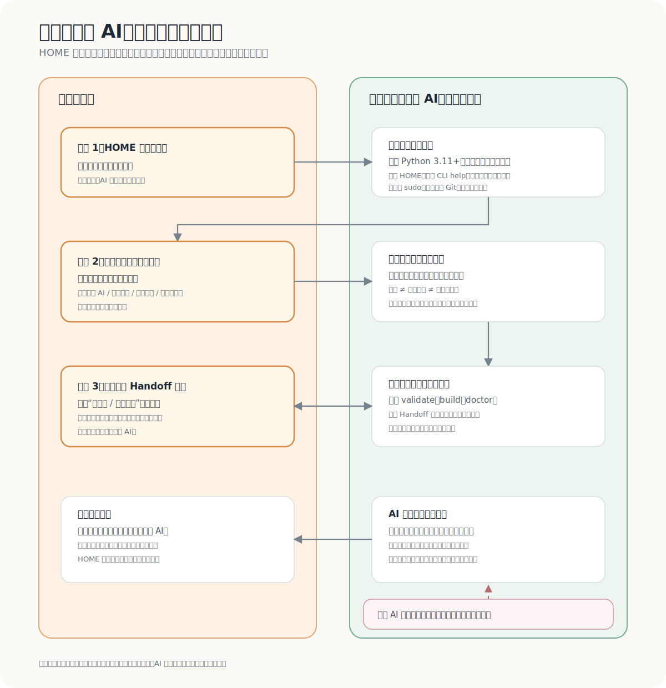

# HOME 零技术用户安装与使用指南

> 把安装交给 AI，把决定权留给自己。

HOME 不会让 AI 获得永久记忆。在具备电脑操作权限的 AI 协助下，HOME 可以把你已经确认的信息保存并编译成一份由你控制的**上下文交接文件**（Context Handoff）。当你换到新窗口、模型或工具时，把这份文件交给新的 AI，它就能更快理解项目背景、协作方式和已经确认的状态。

**上下文延续不等于 AI 记忆。** 它不表示不同窗口里的 AI 拥有连续意识；HOME 管理的是你允许交付给某次任务的上下文。



## 这份指南适合谁

这份指南假设你会使用 AI，但不必会写代码或使用终端。

有两类 AI：

1. **只有聊天能力的 AI** 可以解释流程、帮你写草稿和检查文字；它不能声称已经安装软件、读取文件或生成了真实文件。
2. **具备电脑、文件读写和终端权限的 AI** 可以代为执行安装和初始化，但必须逐步展示操作结果，并在隐私相关步骤等待你的确认。

如果你不确定当前 AI 属于哪一类，直接问它：**“你能实际操作我的电脑、读取文件和运行终端吗？请只回答你能验证的能力。”**

## 你只需要确认三次

| 何时 | 你决定什么 | AI 可以做什么 |
| --- | --- | --- |
| 1. 开始前 | HOME 工作区放在哪里 | 检查系统、准备独立环境、安装并初始化示例工作区 |
| 2. 整理信息前 | 哪些内容准确，哪些内容可以共享 | 只把你确认的内容整理为草稿和候选信息 |
| 3. 使用前 | 是否批准最终 Context Handoff | 展示交接文件、说明可见与不可见内容、给出路径 |

如果 AI 需要使用 `sudo`、管理员权限、读取私人文件、访问云端账户或安装系统级软件，必须先单独征得你的明确同意。这是安全例外，不是额外的内容确认。

## 先复制这段给能操作电脑的 AI

把下面整段发给具备电脑、文件读写和终端权限的 AI。方括号中的内容由你在第一次确认时填写；没有确认前，AI 不应自行选择位置。

```text
请作为 HOME Framework 的本地安装与上下文整理助手，按以下规则执行。

目标：在我确认的位置建立一个本地 HOME 工作区，安装 home-framework==0.1.0a4，生成第一份待我批准的 Context Handoff。

第一步：先说明你是否真的具备电脑、文件读写和终端操作权限。没有这些权限时，不要假装已经安装或创建文件；只给我可自行执行的说明。

第二步：向我确认一次工作区位置。我要使用的位置是：[填写工作区位置，例如“文稿/我的-HOME”]。

第三步：在不读取我的私人文件前，检查操作系统和 Python 版本。HOME 需要 Python 3.11 或更新版本。

第四步：优先使用独立虚拟环境安装工具；不要使用 sudo 或管理员权限，除非我在当前对话中明确批准。安装：
python -m pip install home-framework==0.1.0a4

第五步：用当前 CLI 的 --help 核对 home、home init、home validate、home build 和 home doctor 的实际命令与参数，再初始化工作区并运行 validate、build、doctor。

第六步：不要初始化 Git，不要创建远程仓库，也不要主动把文件上传到额外的第三方服务、公开仓库或共享链接。开始前请说明你的执行环境是否属于云端服务，以及你读取的内容是否可能进入服务商的处理范围。不要写入 API key、密码、证件号码、银行卡信息、精确住址或其他高敏感信息；不要读取与这项任务无关的文件。

第七步：在读取任何本地私人文件前，只根据当前对话中我主动提供的信息，先向我展示一份普通语言的“信息整理草稿”。如果还需要读取其他文件，必须逐项说明文件和用途，并另行征得我的同意。把内容清楚分成：
- 我已经确认、可用于当前项目的信息；
- 仍待我确认的候选信息；
- 不允许共享或不应写入交接文件的信息。

不要把你的推测写成我的事实；不要自动批准候选信息；不要声称我获得了永久记忆或连续意识。

第八步：等我确认内容准确及共享边界后，才把获准信息写入 HOME 的对应结构，运行 validate、build 和 doctor，并展示生成的 Context Handoff 全文、文件路径，以及“这次 AI 会看到 / 不会看到”的清单。

第九步：把生成结果标记为“待用户批准”。在我明确批准前，不要把它交给其他 AI、上传、分享或当作已经生效的长期事实。

每一步都用简短中文说明：你准备做什么、实际做了什么、结果是什么。如果某一步失败，停止并说明原因与可选处理方式。
```

## 云端 AI 的隐私边界

HOME 是 **local-first**：工作区和交接文件由你放在本地管理。但“让 AI 代操作”是否属于云端服务，是另一件事。

- 安装阶段通常不需要读取你的私人资料。
- 云端 AI 一旦读取到你粘贴的文本、上传的文件或允许它访问的内容，这些内容可能进入对应服务商的处理范围。
- 在让云端 AI 读取私人内容前，AI 必须单独询问并等待你同意。
- 高敏感内容建议不写入 HOME、由你手动处理，或只交给你自行选择的本地模型。
- 不应承诺“云端 AI 代操作时所有内容绝不会离开本机”。

如果你只使用普通聊天 AI，可以先让它帮你设计信息草稿；真正的文件创建、命令执行和安装，应由你自己或具备相应权限的工具完成。

## AI 怎样整理你的信息

你不需要了解 YAML、schema 或内部目录。你只需要用普通语言选择每一条信息属于哪一类：

| 你的说法 | 代表什么 |
| --- | --- |
| “可以给外部 AI。” | 可以进入这次或后续批准范围内的交接文件。 |
| “只保留在本地。” | 可以留在本地工作区，但不交给外部 AI。 |
| “每次使用前问我。” | 不能自动复用；下一次仍须单独确认。 |
| “永远不进入交接文件。” | 不应写入可交付给 AI 的内容。 |

AI 整理时只应处理四类内容：

- 稳定、已经确认的信息；
- 当前项目与当前状态；
- 等待你确认的候选信息；
- 明确不允许共享的信息。

“草稿”“候选信息”和“最终批准”不是一回事：草稿只是便于你审阅的文字；候选信息尚不能作为事实使用；只有你明确批准后的交接文件，才能用于本次 AI 协作。

技术上，HOME 会把这些选择映射到经过校验的本地文件结构；你不需要亲自编辑这些文件，但应始终看得见 AI 准备写入和准备交付的内容。

## 最终预览：请先看，再批准

在第三次确认前，AI 必须给你一个简短预览，格式至少应当包含：

```text
这次 AI 会看到
- [已确认、与当前任务有关的信息]

这次 AI 不会看到
- [未获批准、过期、候选或高敏感的信息]

Context Handoff 路径
- [本地文件路径]

状态
- 待用户批准：尚未交给其他 AI，尚未上传或分享
```

你可以：

- 批准；
- 删除某一项后再看；
- 改成“每次先问我”；
- 直接停止，不需要解释理由。

批准的意思只是：**这份文件可以用于你当前指定的 AI 任务。** 它不等于授权 AI 自动保留所有聊天，也不等于授权下一次使用时自动共享同样内容。

## 你完成后会得到什么

一个完成后的 HOME 工作区通常会有：

- 本地、可检查的已确认信息；
- 一份经过 `validate` 检查的结构；
- 一份经过 `build` 生成的 Context Handoff；
- 一次 `doctor` 的诊断结果；
- 由你决定是否使用、分享或重新生成的交接文件。

如果你想进一步理解工具的技术边界，请阅读 [中文项目入口](../../README.zh-CN.md)、[隐私模型](../privacy-model.md) 与 [安全政策](../../SECURITY.md)。

## 常见问题

### AI 说“已经安装好了”，但它其实只有聊天能力，怎么办？

把它当作未完成。要求它说明实际验证证据，例如终端输出、创建的本地文件路径或命令结果；如果它不能提供，就请它改为只给你步骤。

### 我现在还不知道哪些内容该共享，能先安装吗？

可以。安装和初始化不需要读你的私人资料。把内容整理停在草稿或候选信息阶段，等你准备好再做第二次确认。

### 我换了 AI，新的 AI 会自动知道一切吗？

不会。你需要把经过批准的 Context Handoff 提供给新的 AI，并且仍要根据当次任务决定是否适合使用。HOME 降低重复介绍的成本，但不会伪造记忆、意识或未经确认的授权。

---

当前指南适用于 `home-framework==0.1.0a4`，要求 Python 3.11 或更新版本；该版本仍处于 alpha 阶段，命令输出和文件格式可能变化。
